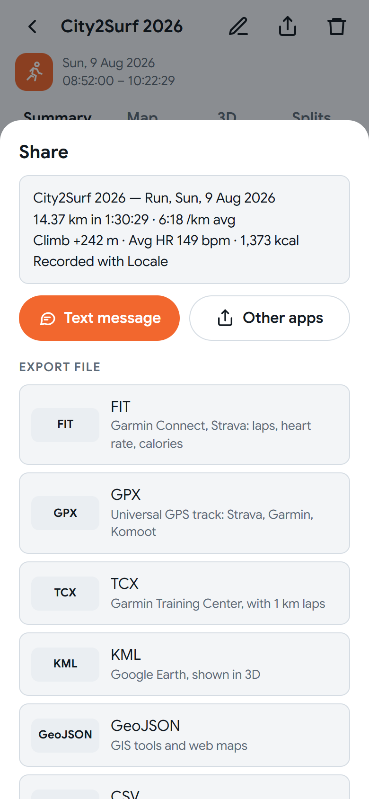
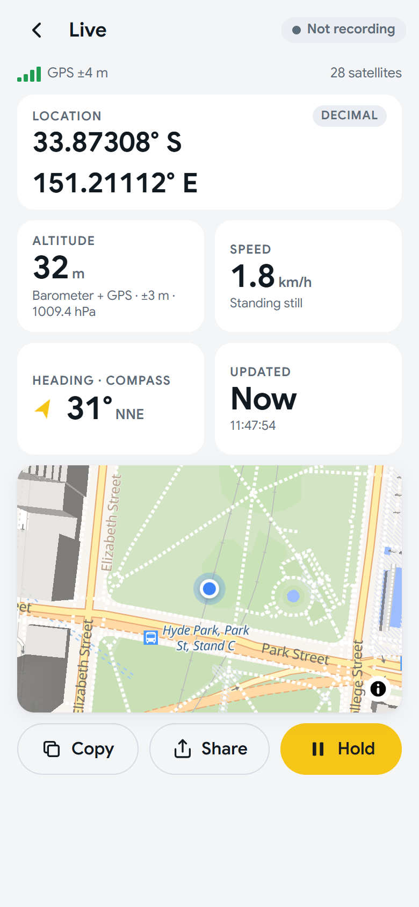
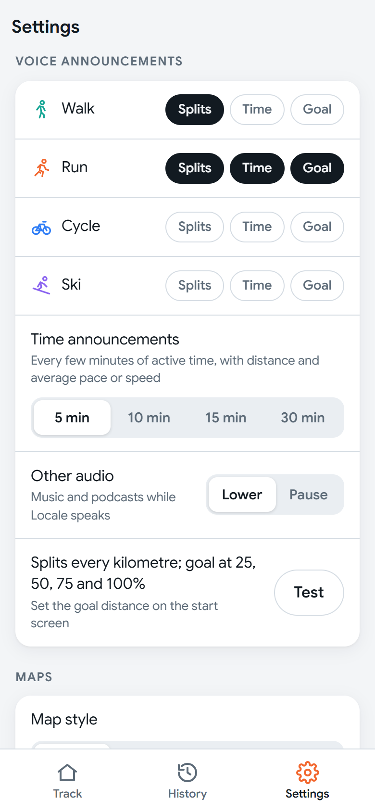
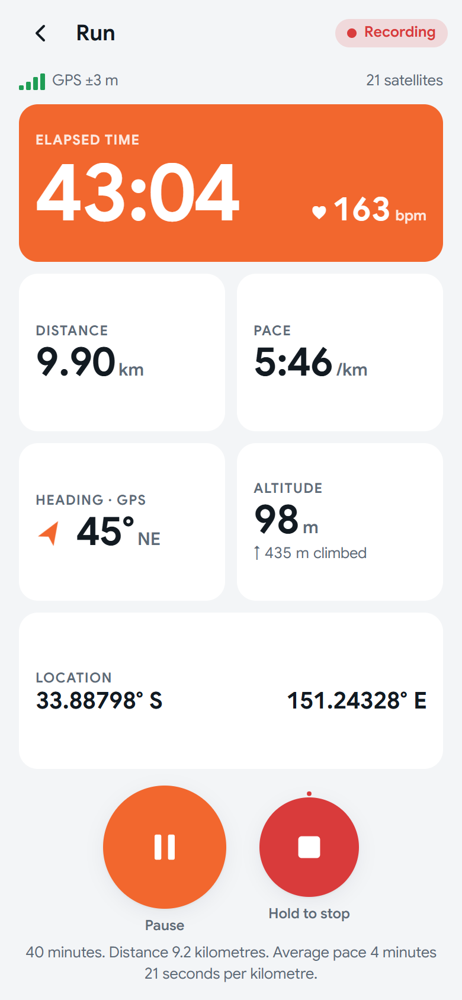

# Locale Exercise Tracker

Locale is a GPS workout tracker for Android 16+ covering **walking, running, cycling and
snow skiing**. It records reliably in the background with the screen off. A **Wear OS
companion** lets you start and stop workouts from your watch and adds live heart rate.
Home-screen widgets start a workout in one tap, and **voice announcements** call out
your splits, time and goal progress as you go. Locale **learns your routines**, and
sets the goal distance for a workout on its own once it knows them. A **Live** mode shows your position,
altitude, speed and heading without recording anything.
Afterwards you can review each workout as stats, heart-rate effort (calories, cardio load,
zones), splits, an interactive map with an elevation side view, or a 3D plot over
satellite imagery. Then you can export it as **FIT** (for Strava and Garmin Connect),
GPX, TCX, KML, GeoJSON or CSV.

The app is written in HTML5, vanilla JavaScript and CSS3, and packaged with
[Capacitor](https://capacitorjs.com/). A small Java plugin handles background GPS and
sensors.

<p align="center">
  
  &nbsp;
  
  &nbsp;
  
</p>
<p align="center">
  
  &nbsp;
  
  &nbsp;
  
</p>
<p align="center">
  
  &nbsp;
  
  &nbsp;
  
</p>
<p align="center">
  
  &nbsp;
  
</p>
<p align="center">
  
  &nbsp;
  
</p>

<sub>The phone screenshots show the built-in sample workout, a simulated run of the Sydney
City2Surf (Hyde Park to Bondi via Heartbreak Hill at 6:18/km, with simulated heart rate).
It is generated from the course map and is not a real recording. The voice screenshots
come from the browser simulator. The watch screenshots
are from a Pixel Watch 3; the workout screen uses the debug build's demo mode.</sub>

## Features

### Record
- **Four activities:** walk, run, cycle and ski, each with tuned accuracy filters and
  stationary thresholds.
- **Controls:** start, pause, resume and **hold-to-stop**, so a gloved hand can't end a
  workout by accident.
- **Auto-pause:** optional, set separately for each activity.
- **Live position mode:** the yellow **Live** tile shows where you are without recording
  anything:
  - coordinates, as decimal or degrees-minutes-seconds
  - GPS accuracy and satellites
  - barometric altitude with vertical accuracy and air pressure
  - speed, and heading from the compass or GPS
  - a live map with an accuracy circle
  - **Copy**, **Share** and **Hold**

  Sensors stop as soon as you leave the screen.
- **Home-screen widgets:**
  - **1×1:** your last-used activity
  - **2×1:** run and walk
  - **2×2:** all four activities

  One tap starts recording, even with the app closed. While recording, the widget shows
  the activity, a running timer and distance. Add one from Settings → Home-screen widgets.
- **Live screen:**
  - elapsed time
  - distance
  - speed or pace (tap to switch)
  - heading: GPS course while moving, compass when slow
  - latitude/longitude
  - altitude and climb so far
  - GPS accuracy and satellite count
- **Background tracking** runs through a location foreground service:
  - fused GPS at 1 Hz, high accuracy
  - barometer fused with GNSS altitude, for smooth climb figures
  - mean-sea-level altitude
  - GNSS satellite status
- **Voice announcements**, spoken by the phone even with the screen off:
  - **Splits:** every km or mile, with the split time and average pace or speed.
  - **Time:** every 5, 10, 15 or 30 minutes of active time, with distance and average.
  - **Goal:** at 25%, 50%, 75% and 100% of a goal distance set on the start screen.

  Each kind is on or off per activity (Settings → Voice announcements). Music is lowered
  or paused while Locale speaks, and nothing is said while paused.
- **Auto goals:** the goal distance is predicted from your routines; see
  [Auto goals](#auto-goals-how-locale-learns-your-routines).
- **Lock-screen notification** with pause, resume and stop. It shows as an Android 16
  Live Update.
- **Crash-safe recording:** every fix goes to an on-disk journal. A workout survives the
  app being killed, and interrupted workouts can be saved or continued.

### Wear OS watch (Pixel Watch and other Wear OS 5+ watches)
- **Start, pause, resume and stop** phone workouts from the watch app or its tile. Stop
  needs a second tap.
- **Live heart rate** from the watch, read through Wear OS Health Services and streamed to
  the phone about every 3 s. It's saved into the workout recording, so every GPS point
  has a heart rate.
- **Watch screen:** elapsed time, distance, pace or speed, and heart rate. The workout
  also shows on the watch face as an ongoing activity.
- **Starting with the phone in your pocket** needs location set to "Allow all the time"
  (Settings → Watch). Without it, the watch asks you to tap a notification on the phone.
- **Pull to refresh** on the Track and History screens picks up workouts recorded from the watch, a
  widget or the notification while the app wasn't open, and shows one still in progress.
  The list also refreshes by itself whenever you come back to the app.

### Review
- **Stats:**
  - distance
  - time, moving time and stationary time
  - average speed and average pace
  - max speed
  - climb, descent and net vertical
  - min and max altitude
- **Ski extras:** runs, lifts, ski vertical, lift time and max run speed.
- **Effort**, when you've filled in the profile (sex, birth year, weight):
  - average and max heart rate
  - **calories**: Keytel 2005 heart-rate equation, or ACSM/MET from speed and slope
    without heart rate
  - **cardio load** (Banister TRIMP)
  - time in heart-rate zones
- **Heart-rate line** on the elevation profile, with heart rate per split and in the
  marker popovers. GPX, TCX and CSV exports include heart rate.
- **Splits** per km or mile, with pace, elevation change and fastest/slowest bars.
- **Map:**
  - MapLibre with free OpenFreeMap streets, light or dark styles, or OpenTopoMap topo.
  - The route is coloured by speed, with subtle direction chevrons.
  - **Distance markers** open a popover showing distance, time, clock time, latitude,
    longitude and altitude.
- **Elevation side view** below the map. Drag the marker along the route, or scrub the
  profile, and the two follow each other.
- **3D view:**
  - Three.js plot with an altitude exaggeration slider from 1× to 10×.
  - **Satellite imagery** on the ground.
  - Direction arrows, and the same clickable distance markers as the map.
  - **Smooth** route: a 10-second time-weighted average removes GPS noise and altitude
    bounce from the drawn line (display only; stats and exports use the raw track).
    Toggle it on the 3D view or in Settings.
- **Share as text:** a short summary (distance, time, pace or speed, climb, heart rate,
  calories) by **SMS** with one tap, or to any app through the Android share sheet.
- **Export** through the Android share sheet as:
  - **FIT**: Garmin's binary activity format, the best fit for Strava and Garmin Connect.
    Includes per-km laps, heart rate, climb and calories. The encoder is written from the
    FIT protocol spec and checked in tests with Garmin's official FIT SDK.
  - GPX, TCX, KML (3D in Google Earth), GeoJSON or CSV.

### General
- **Units:** metric by default, imperial in Settings.
- **Theme:** light, dark and auto.
- **Font:** Google Sans, bundled for offline use.
- **Privacy:** workouts are stored only on the device. The network is used for map tiles
  and nothing else.
- **Storage:** on Android, workouts live in an app-private **SQLite** database. Existing
  IndexedDB data migrates automatically on first launch, verified per track by CRC-32.
  A workout stopped from the watch, a widget or the notification is processed and saved
  natively right away. The browser build keeps IndexedDB.

## Auto goals: how Locale learns your routines

Most people repeat a few workouts, such as a Saturday morning loop of the lake or a
run along the river after work on Tuesdays and Thursdays. Locale notices these
**routines** and uses them to set the goal distance for you, so you hear "25 percent of
your goal" without setting anything up.

### What it does
- **When you start a workout**, Locale works out which routine you are probably doing.
  It decides at the first good GPS fix, or from the time of day if there is no fix
  after 90 seconds. If it is confident, it sets the goal and tells you:
  *"Goal 4.7 kilometres, your usual Saturday morning loop."*
- **During the workout** it announces 25%, 50%, 75% and "Goal reached" at 100%, along
  with your distance and average pace or speed.
- **If you leave the usual route**, meaning more than 250 m from it for over 2 minutes,
  it says *"Off your usual route. Goal announcements paused."* Splits and time
  announcements carry on.
- **If it isn't sure, it says nothing.** It never guesses between two equally likely
  routines, and it never sets a goal at a place it doesn't know.
- **Afterwards**, the workout summary shows the goal and whether you finished within 10%
  of it. The watch shows goal progress as a ring round the screen.

### How it learns
1. **It looks at your saved workouts**, on the phone only, nothing is sent anywhere.
   For each workout it reads the activity, the local weekday and start time, where it
   started and finished, the shape of the route, and the distance and time taken. The
   built-in sample and very short workouts (under 500 m or 3 minutes) are left out.
2. **It groups workouts that are the same routine.** That means the same activity, a
   start within 300 m, distances within 12%, and routes that overlap. Two routes overlap
   when they stay, on average, within 120 m or 4% of the distance of each other. A loop
   run the other way round counts as the same route.
3. **It describes each routine:**
   - how often you do it, with recent workouts counting more (each 60 days halves the
     weight)
   - the usual weekday and start time
   - the usual distance and how much it varies
   - a name such as "Saturday morning loop" or "weekday evening route"
4. **It works out the goal:** the usual (median) distance, rounded to 0.1 km or mi. If
   your distances cluster around a round number, such as 4.9–5.1 km, the goal is that
   number: "5 kilometres".
5. **It checks it has enough history first.** Auto goals start once an activity has 5
   workouts in the last 6 months. A routine counts once it has 3 workouts, 2 of them in
   the last 60 days, with distances that vary by no more than about 12%.
6. **It picks one routine when you start.** Each routine that starts near you is scored
   on how often you do it, how close you are to its usual start time, and whether today
   is its usual day. Workouts from the same spot that fit no routine count against the
   leader. A routine wins only with a clear lead: at least 70% of the score, and well
   ahead of the next. Before a GPS fix, Locale can fall back to your usual distance for
   that time of week, such as "weekend morning walks".
7. **It learns from its mistakes.** Each workout keeps the goal it was given. If a
   routine's recent auto goals mostly missed (fewer than half of the last 5 within 10%),
   that routine is paused. If you also stopped doing it, its workouts are set aside, so
   a new habit can take over quickly.

The model is rebuilt whenever your workout list changes, including when you come back
to the app after recording from the watch. The phone's tracking service reads it, so
workouts started from the watch or a widget get an auto goal too.

### Your controls
- **Settings → Voice announcements:** each activity's goal chip cycles between
  **Auto goal** (the default; ski is Off), **Set goal** (a distance you choose on the
  start screen) and **Off**. You can also turn off "Say the goal at the start".
- **Start screen:** shows the auto goal and the routine it came from, or "learning · 3
  of 5 runs". Use − or + to set a different goal for this workout only.
- **Settings → Learned routines:** each routine's distance, how often you do it, the
  usual day and time, and how often its goal was hit. You can **Rename** it (Locale then
  says "your usual lake loop") or **Forget** it, which leaves its workouts out of
  learning. **Restore** undoes forgetting.

The thresholds were tuned with `scripts/evaluate-goals.mjs`. It replays generated
histories in date order and predicts each workout from the earlier ones only. On
typical routines, 100% of auto goals landed within 10% of the actual distance, and
histories of random one-off workouts got no goals at all. The design and numbers are in
[docs/plans/goal-prediction.md](docs/plans/goal-prediction.md).

## Getting started

Requirements:
- Node 20+
- Android Studio, whose bundled JDK works
- Android SDK platform 36
- A device or emulator running Android 16 or later

```sh
npm install
npm test         # unit tests (Vitest)
npm run dev      # run in a browser with a simulated GPS route
```

The browser build uses a GPS simulator that starts at Hyde Park, Sydney. Add `?sim=10` to
the URL to run it 10× faster.

### Build and install on a device

```sh
npm run build
npx cap sync android
cd android
# Point JAVA_HOME at Android Studio's bundled JDK, e.g.
#   set JAVA_HOME=C:\Program Files\Android\Android Studio\jbr
gradlew.bat assembleDebug
adb install -r app/build/outputs/apk/debug/app-debug.apk
```

You can also open `android/` in Android Studio and press **Run**.

### Install on a Wear OS watch

```sh
gradlew.bat :wear:assembleDebug
adb -s <watch-serial> install -r wear/build/outputs/apk/debug/wear-debug.apk
```

The watch app uses the phone app's application ID and must be signed with the same key.
Debug builds from one machine already are. To enable debugging on the watch:
1. Settings → System → About → Versions: tap **Build number** 7 times.
2. Settings → Developer options: enable **ADB debugging** and **Wireless debugging**.
3. Run `adb pair <ip:port>` with the code shown, then `adb connect <ip:port>`.

> The Gradle wrapper is pinned to 9.1, because Android Studio's bundled JDK 25 is too new
> for the Gradle 8.x that Capacitor generates. `android/local.properties` (gitignored)
> must point `sdk.dir` at your Android SDK.

### Testing GPS

- **Emulator:** Extended controls → Location → load a GPX/KML route and press play.
- **Background survival:** start a workout, turn the screen off, then run
  `adb shell dumpsys deviceidle force-idle`.

## Project layout

```
src/
  main.js, router.js, settings.js, units.js, activities.js
  tracker/   native plugin client + browser simulator, journal parser
  geo/       geodesy, Kalman/RTS smoothing, journal → track processing, snapping
  stats/     summary, splits, hysteresis climb, stationary time, ski runs
  db/        storage facade: SQLite on Android (nativeStore), IndexedDB in the browser
             (idbStore), track codec, one-time migration
  export/    FIT, GPX, TCX, KML, GeoJSON, CSV
  map/       MapLibre workout map, Live position map    profile/  elevation side view
  view3d/    Three.js 3D view, satellite imagery, display smoothing
  seed/      City2Surf sample workout (course data + generator)
  stats/physio.js  heart-rate zones, TRIMP, calories
  views/     home, live (workout), position (Live mode), history, detail, settings
  voice/     announcement triggers and phrases (mirrored natively in VoiceCoach)
  insights/  learned routines and goal prediction (matcher mirrored in RoutineMatcher)
android/app/src/main/java/app/locale/exercisetracker/tracker/
  LocaleTrackerPlugin  TrackingService  Journal  AltitudeFusion
  WearListenerService  WearSync          (watch link)
  LocaleWidgets  Widget1x1/2x1/2x2Provider  (home-screen widgets)
  VoiceCoach  Speaker                        (voice announcements, text-to-speech)
  RoutineMatcher  RouteGuard                 (auto goals from learned routines)
android/app/src/main/java/app/locale/exercisetracker/store/
  WorkoutStore (SQLite)  LocaleStorePlugin  TrackCodec  WorkoutBuilder (JS processing port)
android/wear/            Wear OS companion app (Kotlin, Compose for Wear OS)
  MainActivity  HeartRateService  PhoneLink  PhoneListenerService  LocaleTileService
tests/       Vitest suites
docs/        screenshots
```

See [PLAN.md](PLAN.md) for the design and decisions, and [BACKLOG.md](BACKLOG.md) for
the feature requests (all done so far).

## Credits

- **Map data:** © [OpenStreetMap](https://www.openstreetmap.org/copyright) contributors.
- **Map tiles:** [OpenFreeMap](https://openfreemap.org) and
  [OpenTopoMap](https://opentopomap.org) (CC-BY-SA).
- **Satellite imagery:** © Esri, Maxar, Earthstar Geographics.
- **Sample course elevation:** Copernicus GLO-90 DEM via [Open-Meteo](https://open-meteo.com).
- **FIT protocol:** files are validated in tests with Garmin's
  [FIT SDK](https://developer.garmin.com/fit/) (a dev dependency only; it isn't shipped
  in the app).
- **Font:** [Google Sans](https://fonts.google.com/specimen/Google+Sans) (SIL Open Font
  License).

## License

[MIT](LICENSE) © 2026 Andrew Rigney
