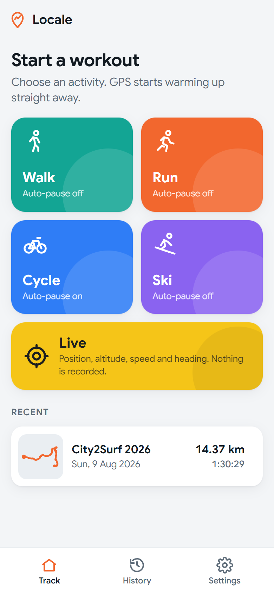
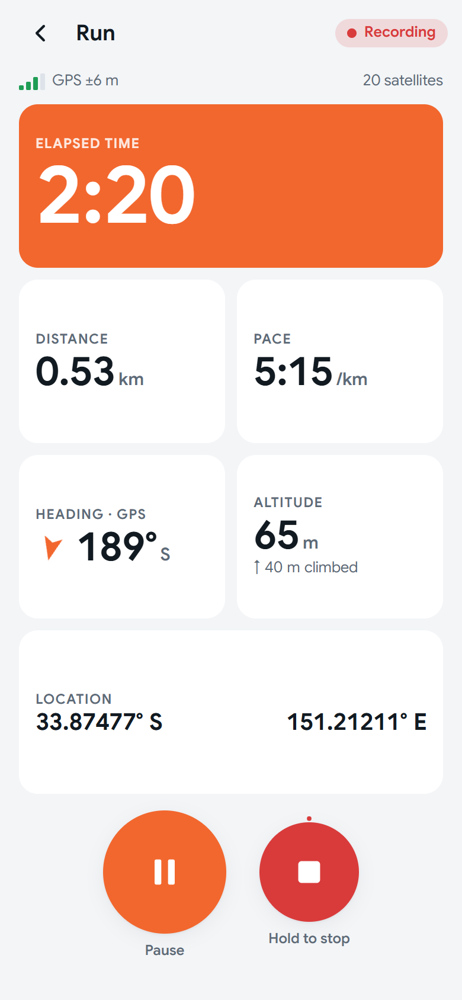
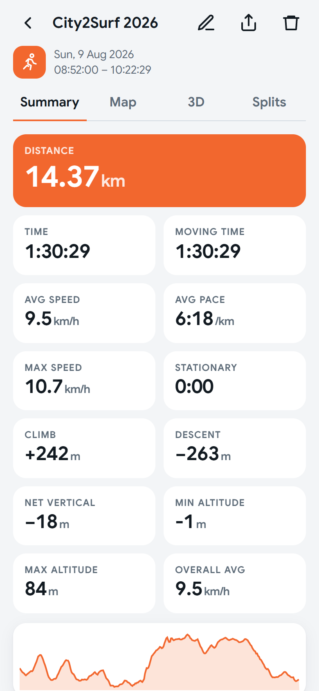
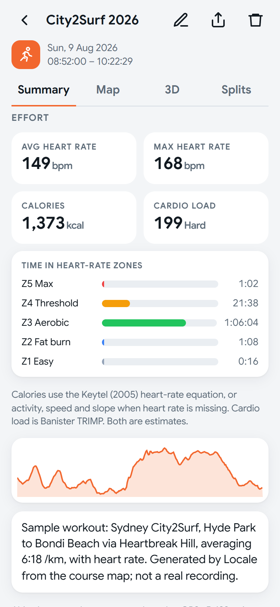
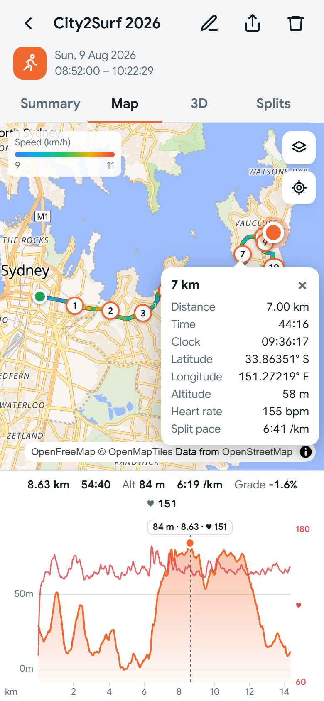
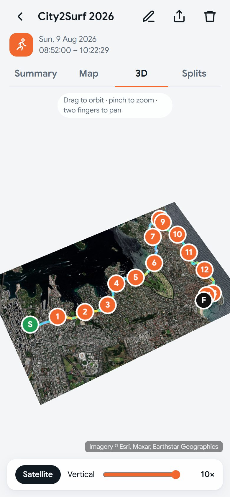
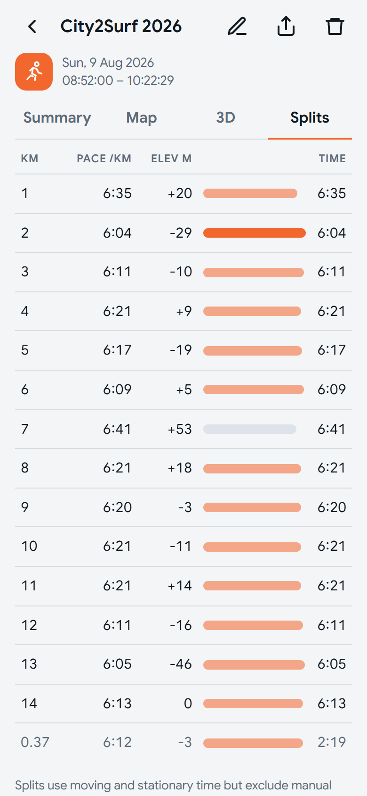
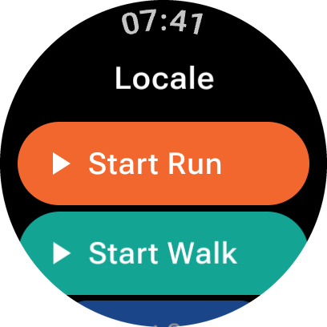
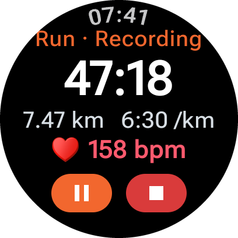

# Locale Exercise Tracker

Locale is a GPS workout tracker for Android 16+ covering **walking, running, cycling and
snow skiing**. It records reliably in the background with the screen off. A **Wear OS
companion** lets you start and stop workouts from your watch and adds live heart rate.
Afterwards you can review each workout as stats, heart-rate effort (calories, cardio load,
zones), splits, an interactive map with an elevation side view, or a 3D plot over
satellite imagery.

The app is written in HTML5, vanilla JavaScript and CSS3, and packaged with
[Capacitor](https://capacitorjs.com/). A small Java plugin handles background GPS and
sensors.

<p align="center">
  
  &nbsp;
  
  &nbsp;
  
</p>
<p align="center">
  
  &nbsp;
  
  &nbsp;
  
</p>
<p align="center">
  
  &nbsp;
  
  &nbsp;
  
</p>

<sub>The phone screenshots show the built-in sample workout, a simulated run of the Sydney
City2Surf (Hyde Park to Bondi via Heartbreak Hill at 6:18/km, with simulated heart rate).
It is generated from the course map and is not a real recording. The watch screenshots
are from a Pixel Watch 3; the workout screen uses the debug build's demo mode.</sub>

## Features

### Record
- **Four activities:** walk, run, cycle and ski, each with tuned accuracy filters and
  stationary thresholds.
- **Controls:** start, pause, resume and **hold-to-stop**, so a gloved hand can't end a
  workout by accident.
- **Auto-pause:** optional, set separately for each activity.
- **Live screen:**
  - elapsed time
  - distance
  - speed or pace (tap to switch)
  - heading: GPS course while moving, compass when slow
  - latitude/longitude
  - altitude and climb so far
  - GPS accuracy and satellite count
- **Background tracking** runs through a location foreground service:
  - fused GPS at 1 Hz, high accuracy
  - barometer fused with GNSS altitude, for smooth climb figures
  - mean-sea-level altitude
  - GNSS satellite status
- **Lock-screen notification** with pause, resume and stop. It shows as an Android 16
  Live Update.
- **Crash-safe recording:** every fix goes to an on-disk journal. A workout survives the
  app being killed, and interrupted workouts can be saved or continued.

### Wear OS watch (Pixel Watch and other Wear OS 5+ watches)
- **Start, pause, resume and stop** phone workouts from the watch app or its tile. Stop
  needs a second tap.
- **Live heart rate** from the watch, read through Wear OS Health Services and streamed to
  the phone about every 3 s. It's saved into the workout recording, so every GPS point
  has a heart rate.
- **Watch screen:** elapsed time, distance, pace or speed, and heart rate. The workout
  also shows on the watch face as an ongoing activity.
- **Starting with the phone in your pocket** needs location set to "Allow all the time"
  (Settings → Watch). Without it, the watch asks you to tap a notification on the phone.

### Review
- **Stats:**
  - distance
  - time, moving time and stationary time
  - average speed and average pace
  - max speed
  - climb, descent and net vertical
  - min and max altitude
- **Ski extras:** runs, lifts, ski vertical, lift time and max run speed.
- **Effort**, when you've filled in the profile (sex, birth year, weight):
  - average and max heart rate
  - **calories**: Keytel 2005 heart-rate equation, or ACSM/MET from speed and slope
    without heart rate
  - **cardio load** (Banister TRIMP)
  - time in heart-rate zones
- **Heart-rate line** on the elevation profile, with heart rate per split and in the
  marker popovers. GPX, TCX and CSV exports include heart rate.
- **Splits** per km or mile, with pace, elevation change and fastest/slowest bars.
- **Map:**
  - MapLibre with free OpenFreeMap streets, light or dark styles, or OpenTopoMap topo.
  - The route is coloured by speed, with subtle direction chevrons.
  - **Distance markers** open a popover showing distance, time, clock time, latitude,
    longitude and altitude.
- **Elevation side view** below the map. Drag the marker along the route, or scrub the
  profile, and the two follow each other.
- **3D view:**
  - Three.js plot with an altitude exaggeration slider from 1× to 10×.
  - **Satellite imagery** on the ground.
  - Direction arrows, and the same clickable distance markers as the map.
- **Export** through the Android share sheet as:
  - **FIT**: Garmin's binary activity format, the best fit for Strava and Garmin Connect.
    Includes per-km laps, heart rate, climb and calories. The encoder is written from the
    FIT protocol spec and checked in tests with Garmin's official FIT SDK.
  - GPX, TCX, KML (3D in Google Earth), GeoJSON or CSV.

### General
- **Units:** metric by default, imperial in Settings.
- **Theme:** light, dark and auto.
- **Font:** Google Sans, bundled for offline use.
- **Privacy:** workouts are stored only on the device. The network is used for map tiles
  and nothing else.

## Getting started

Requirements:
- Node 20+
- Android Studio, whose bundled JDK works
- Android SDK platform 36
- A device or emulator running Android 16 or later

```sh
npm install
npm test         # unit tests (Vitest)
npm run dev      # run in a browser with a simulated GPS route
```

The browser build uses a GPS simulator that starts at Hyde Park, Sydney. Add `?sim=10` to
the URL to run it 10× faster.

### Build and install on a device

```sh
npm run build
npx cap sync android
cd android
# Point JAVA_HOME at Android Studio's bundled JDK, e.g.
#   set JAVA_HOME=C:\Program Files\Android\Android Studio\jbr
gradlew.bat assembleDebug
adb install -r app/build/outputs/apk/debug/app-debug.apk
```

You can also open `android/` in Android Studio and press **Run**.

### Install on a Wear OS watch

```sh
gradlew.bat :wear:assembleDebug
adb -s <watch-serial> install -r wear/build/outputs/apk/debug/wear-debug.apk
```

The watch app uses the phone app's application ID and must be signed with the same key.
Debug builds from one machine already are. To enable debugging on the watch:
1. Settings → System → About → Versions: tap **Build number** 7 times.
2. Settings → Developer options: enable **ADB debugging** and **Wireless debugging**.
3. Run `adb pair <ip:port>` with the code shown, then `adb connect <ip:port>`.

> The Gradle wrapper is pinned to 9.1, because Android Studio's bundled JDK 25 is too new
> for the Gradle 8.x that Capacitor generates. `android/local.properties` (gitignored)
> must point `sdk.dir` at your Android SDK.

### Testing GPS

- **Emulator:** Extended controls → Location → load a GPX/KML route and press play.
- **Background survival:** start a workout, turn the screen off, then run
  `adb shell dumpsys deviceidle force-idle`.

## Project layout

```
src/
  main.js, router.js, settings.js, units.js, activities.js
  tracker/   native plugin client + browser simulator, journal parser
  geo/       geodesy, Kalman/RTS smoothing, journal → track processing, snapping
  stats/     summary, splits, hysteresis climb, stationary time, ski runs
  db/        IndexedDB: workouts, columnar tracks, gzipped raw journals
  export/    FIT, GPX, TCX, KML, GeoJSON, CSV
  map/       MapLibre map view        profile/  elevation side view
  view3d/    Three.js 3D view, satellite imagery
  seed/      City2Surf sample workout (course data + generator)
  stats/physio.js  heart-rate zones, TRIMP, calories
  views/     home, live, history, detail, settings
android/app/src/main/java/app/locale/exercisetracker/tracker/
  LocaleTrackerPlugin  TrackingService  Journal  AltitudeFusion
  WearListenerService  WearSync          (watch link)
android/wear/            Wear OS companion app (Kotlin, Compose for Wear OS)
  MainActivity  HeartRateService  PhoneLink  PhoneListenerService  LocaleTileService
tests/       Vitest suites
docs/        screenshots
```

See [PLAN.md](PLAN.md) for the design, decisions and roadmap.

## Credits

- **Map data:** © [OpenStreetMap](https://www.openstreetmap.org/copyright) contributors.
- **Map tiles:** [OpenFreeMap](https://openfreemap.org) and
  [OpenTopoMap](https://opentopomap.org) (CC-BY-SA).
- **Satellite imagery:** © Esri, Maxar, Earthstar Geographics.
- **Sample course elevation:** Copernicus GLO-90 DEM via [Open-Meteo](https://open-meteo.com).
- **Font:** [Google Sans](https://fonts.google.com/specimen/Google+Sans) (SIL Open Font
  License).

## License

[MIT](LICENSE) © 2026 Andrew Rigney
